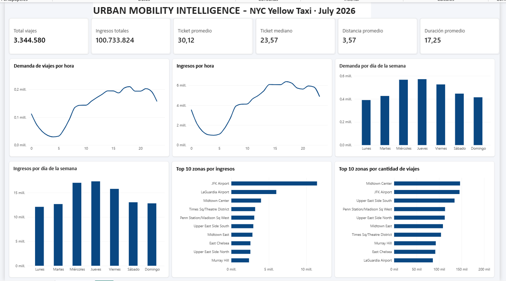

\# Urban Mobility Intelligence

\### NYC Yellow Taxi | Data Analytics Project

\## Project Overview

End-to-end data analytics project focused on analyzing New York City Yellow Taxi trips during July 2026.

The project uses Python, SQL and Power BI to evaluate travel demand, revenue patterns, operational performance and geographic trends.

\## Technologies

\- \*\*Python:\*\* Pandas, PyArrow, Jupyter Notebook

\- \*\*SQL:\*\* DuckDB

\- \*\*Power BI:\*\* Data visualization and interactive dashboard

\- \*\*Git \& GitHub:\*\* Version control

\## Dataset

\- \*\*Source:\*\* NYC Taxi \& Limousine Commission (TLC)

\- \*\*Period:\*\* July 2026

\- \*\*Original dataset:\*\* 3,530,109 trips

\- \*\*Valid trips included in economic analysis:\*\* 3,344,580

\## Key Performance Indicators

| KPI | Result |

|---|---|

| Total trips analyzed | 3,344,580 |

| Total revenue | $100.73 million |

| Average trip amount | $30.12 |

| Median trip amount | $23.57 |

| Average trip distance | 3.57 miles |

| Average trip duration | 17.25 minutes |

\## Project Workflow

1\. \*\*Data Quality Audit:\*\* Inspection of data structure, missing values and inconsistencies.

2\. \*\*Data Cleaning:\*\* Validation and filtering of trip records.

3\. \*\*Feature Engineering:\*\* Creation of variables for temporal and operational analysis.

4\. \*\*Exploratory Data Analysis:\*\* Identification of demand and revenue patterns.

5\. \*\*SQL Analysis:\*\* Calculation of KPIs and aggregated datasets.

6\. \*\*Power BI Dashboard:\*\* Development of an analytical dashboard.

\## Key Insights

\- Thursday recorded the highest travel demand and revenue.

\- Peak trip demand occurred at 6 PM.

\- Peak revenue occurred at 5 PM.

\- JFK Airport generated the highest revenue among pickup zones.

\- Midtown Center recorded the highest number of pickups.

\## Dashboard

The Power BI dashboard includes six KPI cards and six visualizations covering hourly demand, daily patterns, revenue and pickup zones.

The Power BI report is available in the `powerbi/` folder.

\## Project Structure

\- `notebooks/` — Python notebooks for auditing, cleaning, feature engineering, exploratory analysis and SQL.

\- `data/processed/` — Aggregated CSV datasets used in Power BI.

\- `powerbi/` — Power BI dashboard file.

\- `visualizations/` — Dashboard screenshots.

\- `docs/` — Project documentation.

\*\*Note:\*\* Large raw and processed Parquet files are excluded from the repository.

\## Author

\*\*Data Analyst Portfolio Project\*\*

Developed using Python, SQL and Power BI to demonstrate data cleaning, exploratory analysis, business intelligence and data visualization skills.

